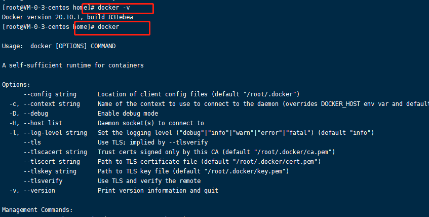
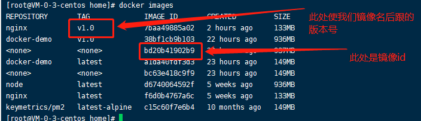
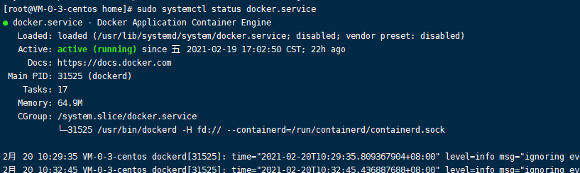

# 使用docker部署简单的项目

目的：记录一下学习docker部署简单项目的思路

思路：

1. 使用docker pull拉取相应的镜像源

2. 创建Dockerfile文件，编写配置文件

3. docker build 运行Dockerfile文件，使用其配置创建新的镜像

4. docker run 创建容器并运行

   

   此处借用一下官方的逻辑图


## 环境配置

环境：CentOS 7

```js
// 使用yum安装docker  此处因使用的个人服务器，是最高权限
sudo yum install docker
```

使用docker -v或者docker可以检测是否安装成功




ps: 关于环境的相关配置，可以自行百度或者google，有大量教程，一般安装失败，都是因为权限的问题（我所遇到的）

## 正式部署

创建一个简单的文件，主要目录如下

```
`-- your-app-name/
    |-- src/
        `-- app.js  // 随便写一些什么
    `-- Dockerfile   (we will create this in the following steps)
```

我们主要关注点是对Dockerfile文件的配置

```dockerfile
# 拉取node镜像源，如果本地没有，会自动从docker hub进行拉取
FROM node:latest
# 执行命令，创建文件夹 此处路径其实不用进行创建
# 在下一步的copy时，如果没有此文件，会自动在路径下创建文件
RUN mkdir -p /home/nodeDemojs
# 复制文件  复制src下的文件到 /home/nodeDemojs
COPY ./src /home/nodeDemojs
# 容器启动时执行的命令，类似npm run start
CMD ["node", "/home/nodeDemojs/app.js"]
```

### 执行文件

1. 执行docker build

   ```shell
   docker build -t 镜像名 .
   // 镜像名后可以跟版本号,格式如 镜像名:v1.0
   // 最后的 . 要特别注意，不能呢个省略，这个作用是绑定我们所执行的上线文
   ```

2. 执行docker images, 查看我们所有的镜像

   

3. 执行docker run

   使用此指令，可以创建一个容器并运行

   ```
   docker run -d -p 3000:3000 docker-demo:v1.0
   ```

   - -d：表示后台运行

   - -p：表示指定端口映射，（3000：3000）表示（本机端口：容器端口），3000是笔者的nestjs代码中监听的访问端口，也是容器对外暴露的端口

   - 镜像名后面的:v1.0：表示打的tag号

## 一些常用的指令

- 查看镜像

  ```
  docker images
  ```

  

- 删除镜像

  ```
  docker rmi 镜像ID
  ```

- 查看运行的容器

  ```
  docker ps
  ```

- 停止容器

  ```
  docker stop 容器ID
  ```

- 检测docker启动状态

  ```
  sudo systemctl status docker.service
  ```

  

- 启动docker

  ```
  sudo systemctl start docker.service
  
  // 执行完上述指令后，再次查看docker当前的状态，执行sudo systemctl status docker.service
  ```

  

- 重启docker

  ```
  sudo systemctl restart docker.service
  ```


github地址：https://github.com/forest-green/docker-demo